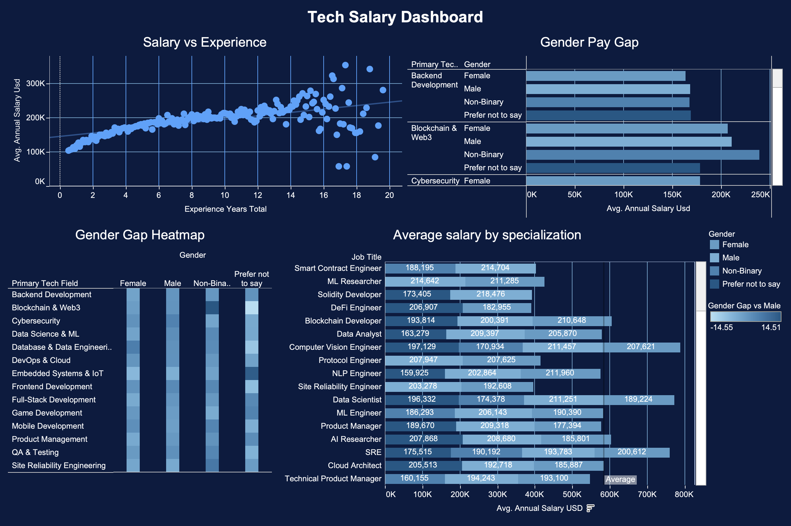

# Tech Salary Dashboard 

An interactive Tableau dashboard analyzing compensation, 
gender pay gaps, and career trends in the tech industry.

---

## Tools & Technologies

- **Tableau Desktop** — data visualization and dashboard design
- **Microsoft Excel** — data preparation and initial exploration

---

## Dataset Overview

The dataset contains anonymized records of tech industry employees 
with the following key fields:

| Category | Fields |
|---|---|
| Demographics | age, gender, location, education_level |
| Role | job_title, primary_tech_field, employment_type, work_arrangement |
| Experience | experience_years_total, experience_years_in_field |
| Compensation | annual_salary_usd, annual_bonus_usd, has_equity, equity_total_value_usd |
| Financials | annual_tax_usd, annual_net_salary_usd, annual_savings_usd |
| Expenses | monthly_housing_usd, monthly_food_usd, monthly_transportation_usd |
| Career | job_satisfaction_score, months_since_last_promotion, is_actively_looking |

---

## Dashboard 1 — Tech Salary Overview

### Visualizations

**1. Average Salary by Job Title** (Bar Chart)
Horizontal bar chart showing average annual salary across all job titles,
color-coded by primary tech field with a reference line at the mean.

**2. Salary vs Experience** (Scatter Plot)
Each point represents one employee. A linear trend line confirms
a positive correlation between total experience and compensation.

**3. Gender Pay Gap by Tech Field** (Grouped Bar Chart)
Side-by-side bars comparing average salaries across Female, Male,
Non-Binary, and Prefer not to say groups within each specialization.

**4. Gender Gap Heatmap**
A color-encoded matrix showing the percentage deviation from the
male average salary per tech field and gender group.
Orange = below male average, Blue = above male average.

**5. Salary by Location** (Map)
Bubble map where size and color represent average annual salary
across global cities where employees are based.

---

## Key Insights

### Compensation
- **Blockchain & Web3** and **AI/ML roles** consistently rank among
  the highest-paying specializations, with averages exceeding $200K
- **Automation Engineers** and **Angular Developers** sit at the lower
  end of the salary range (~$118K–$133K)
- Salary grows steadily with experience up to ~12 years,
  after which variance increases significantly

### Gender Pay Gap
- The overall gender pay gap is relatively modest across most fields,
  ranging from **-14.55% to +14.51%** compared to male average
- **Blockchain & Web3** shows the highest variation — Non-Binary
  employees earn notably more in this field
- **Cybersecurity** shows Male employees earning slightly above
  other gender groups
- Most fields show gaps under 5%, suggesting relatively equitable
  base compensation in tech

### Geography
- Highest average salaries are concentrated in **North America**
  and select **Asian tech hubs**
- One location shows a significantly lower average (~$59K),
  likely reflecting a lower cost-of-living region
